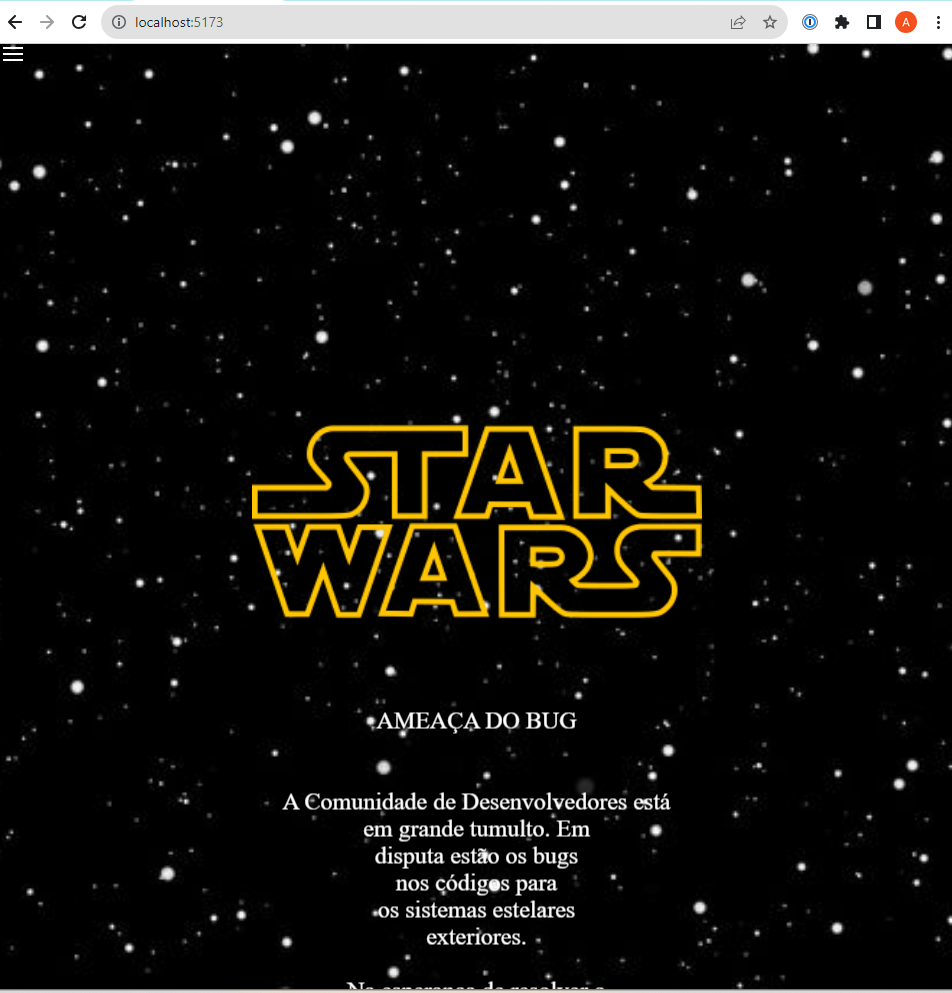
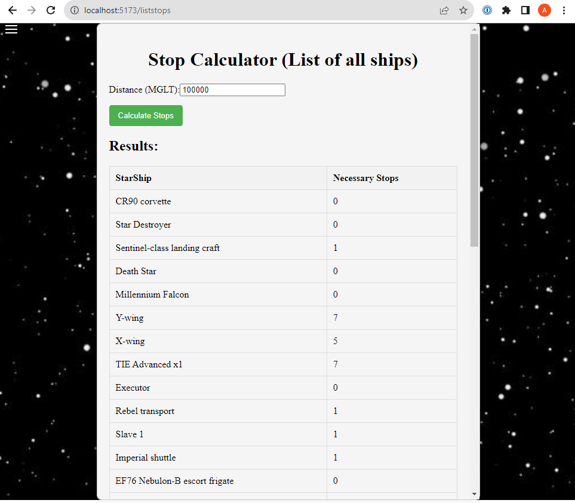
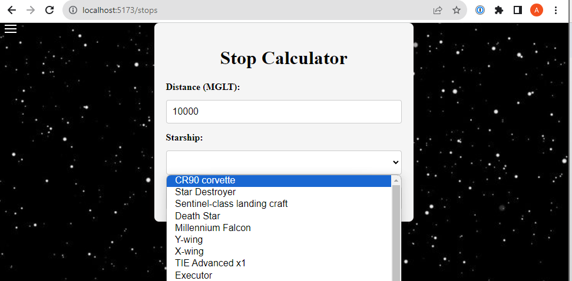

### Devopness - Desafio técnico - Consumir dados dinamicamente via SW API (https://www.swapi.tech/ ou  https://swapi.dev/)
### Funcionalidade:
Calcular quantas paradas serão necessárias para percorrer uma dada distância, com cada uma das espaçonaves listadas pela SW API
### Critérios de aceitação: 
A aplicação receberá como parâmetro a distância a ser percorrida, em mega lights (MGLT); A solução implementada não deve assumir que os dados sobre as aeronaves são estáticos; Como resultado do processamento deverá ser exibida lista com todas as espaçonaves e a quantidade de paradas exigidas por cada uma delas para percorrer a distância informada; Exemplo: Para percorrer a distância de 1000000 (um milhão) de mega lights o resultado correto será: Millennium Falcon: 9, A-wing: 49, Y-wing: 74, nRebel Transport: 11.
Quaisquer outros detalhes da aplicação - tais como apresentação, interação e formatação - ficam a critério do desenvolvedor.

## Recommended IDE Setup

- [VS Code](https://code.visualstudio.com/)
## Customize configuration

See [Vite Configuration Reference](https://vitejs.dev/config/).

## Project Setup

```sh
npm install
```

### Compile and Hot-Reload for Development

```sh
npm run dev
```



